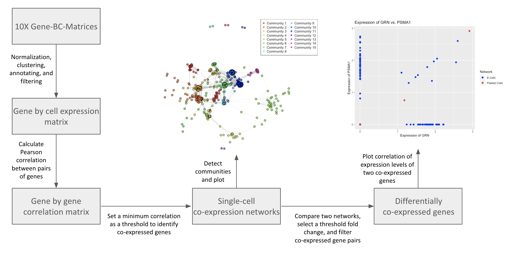

<!-- README.md is generated from README.Rmd. Please edit that file -->

```{r, include = FALSE}
knitr::opts_chunk$set(
  collapse = TRUE,
  comment = "#>",
  fig.path = "man/figures/README-",
  out.width = "100%"
)
```
# DiffCoExpr

## Description

The main objective of DiffCoExpr is to construct co-expression networks from single-cell RNA-sequencing (scRNA-seq) data, and subsequently determine if different conditions within an individual (e.g. cell type) affect co-expression and co-variance of genes. We refer to co-expression correlation as the correlation between the expression level between pairs of genes. We refer to co-variance correlation as the correlation between gene expression changes across different conditions between pairs of genes. `DiffCoExpr` improves the field encompassing co-expression analysis by including functions for co-expression matrix construction and comparison, and also co-variance matrix construction, all in one package. Additionally, this package improves co-expression analysis by operating at the single-cell level; most existing co-expression analysis tools use bulk-RNA-seq or microarray data. As such, most existing packages do not contain any functions that can only be applied to single-cell data (e.g., cell-type-specificity analysis).
<br>
The `DiffCoExpr` package was developed using `R version 4.3.0`, `Platform: x86_64-apple-darwin20.0/12.2.0 (64-bit)` and `Running under: macOS Sonoma 14.1`.

## Installation

To install the latest version of the package:
``` r
install.packages("devtools")
library("devtools")
devtools::install_github("vishali-u/DiffCoExpr", build_vignettes = TRUE)
library("DiffCoExpr")
```
To run the Shiny app:
``` r
# in progress
``` 

## Overview

There are x functions in `DiffCoExpr`
``` r
ls("package:DiffCoExpr")
data(package = "DiffCoExpr") 
browseVignettes("DiffCoExpr")
```
`DiffCoExpr` contains 8 functions.

1.  ***prepareData*** for constructing a Seurat object that normalizes scRNA-seq data, performs dimensional reduction on the data, clusters the data, and annotates the data with cell types (if applicable).

2.  ***getExpressionMatrix*** for filtering genes and constructing a dense matrix of the log-normalized counts.

3.  ***plotExpressionMatrix*** for making a heatmap of the expression matrix.

4. ***getCorrelationMatrix*** for determining the correlation of every pair of gene and constructing a matrix where rows and columns are genes and the cells contain the correlation coefficient between the pair of genes.

5. ***plotCorrelationMatrix*** for making a heatmap of the correlation matrix.

6. ***buildCoexpressionNetwork*** for filtering pairs of genes and constructing an "edge list" where every pair of co-expressed genes are listed with the correlation coefficient between the pair.

7. ***plotCoexpressionNetwork*** for constructing a co-expression network graph where each gene is a node, and co-expressed genes are connected with an edge.

8. ***plotDifferentialCoexpression*** for plotting the distribution of changes in correlation coefficients between pairs of genes from two different co-expression networks.

The package also contains one scRNA sequencing dataset, for which there are three files (barcodes.tsv, genes.tsv, and matrix.mtx). Refer to package vignettes for more details. An overview of the package is illustrated below. 




## Contributions
The author of the package is Vishali Umaiyalan. The author wrote the *prepareData* function, which normalizes, clusters, and annotates single-cell RNA-seq data using the standard Seurat pipeline. The *getExpressionMatrix* and *getCorrelationMatrix* were written solely by the author. The *plotExpressionMatrix* function and *plotCorrelationMatrix* functions both use the `ComplexHeatmap` package. The *buildCoexpressionNetwork* function was written solely by the author, but the approach to filtering gene pairs is similar to approaches used in the `GWENA` package, which constructs co-expression networks from bulk RNA-seq data. The `plotCoexpressionNetwork` and `plotDifferentialCoexpression` functions were written soly by the author. No generative AI tools were used in the development of this package. 

## References

- Butler A, Hoffman P, Smibert P, Papalexi E, Satija R (2018) Integrating single-cell transcriptomic data across different conditions, technologies, and species. *Nature Biotechnology* 36, 411-420. https://doi.org/10.1038/nbt.4096

- Butler, A. (2015). Seurat: Tools for Single Cell Genomics R package. https://cran.r-project.org/web/packages/Seurat

- Chowdhury H., Bhattacharyya D., Kalita J (2020) (Differential) Co-Expression Analysis of Gene Expression: A survey of Best Practices. *IEEE/ACM Transactions on Computational Biology and Bioinformatics* 17. https://ieeexplore.ieee.org/document/8613814

- Contreras-Lopez, Moyano T., Soto D., Gutierrez R (2018) Step-by-Step Construction of Gene Co-expression Networks from High-Throughput Arabidopsis RNA Sequencing Data. *Methods in Molecular Biology* https://pubmed.ncbi.nlm.nih.gov/29525965/

- Eisen M., Spellman P., Brown P., Botstein D (1998) Cluster analysis and display of genome-wide expression patterns. *Biological Sciences* 95. https://www.pnas.org/doi/10.1073/pnas.95.25.14863

- Hennetin J., Pehkonen P., Bellis M (2009) Construction and use of gene expression covariation matrix. *BMC Bioinformatics* 10. https://bmcbioinformatics.biomedcentral.com/articles/10.1186/1471-2105-10-214

- Lemoine G., Scott-Boyer M., Ambroise B., Perin O., Droit A (2021) GWENA: gene co-expression networks analysis and extended modules characterization in a single Bioconductor package. *BMC Bioinformatics* 22. https://bmcbioinformatics.biomedcentral.com/articles/10.1186/s12859-021-04179-4

- R Core Team (2023). R: A language and environment for statistical computing. R Foundation for Statistical Computing, Vienna, Austria. https://www.R-project.org/

- Su C., Xu Z., Shan X., Cai B., Zhao H., Zhang J (2023) Cell-type-specific co-expression inference from single cell RNA-sequencing data. *Nature Communications* 14. https://www.nature.com/articles/s41467-023-40503-7

- Wickham, H. and Bryan, J. (2019). *R Packages* (2nd edition). Newton, Massachusetts: O'Reilly Media. https://r-pkgs.org/


## Acknowledgements
This package was developed as part of an assessment for 2023 BCB410H: Applied Bioinformatics course at the University of Toronto, Toronto, CANADA. `DiffCoExpr` welcomes issues, enhancement requests, and other contributions. To submit an issue, use the [GitHub issues](https://github.com/vishali-u/DiffCoExpr/issues). Many thanks to those who provided feedback to improve this package.

