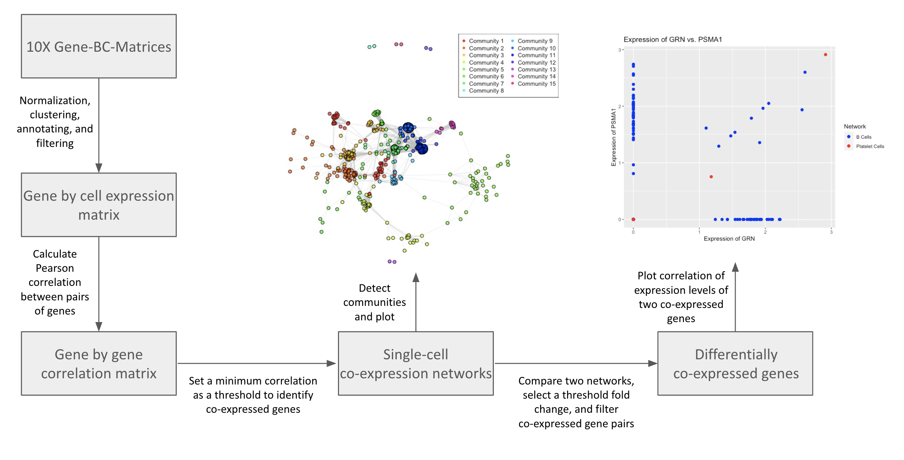

<!-- README.md is generated from README.Rmd. Please edit that file -->

# DiffCoExpr

## Description

The main objective of DiffCoExpr is to construct co-expression networks
from single-cell RNA-sequencing (scRNA-seq) data, and subsequently
determine if different conditions within an individual (e.g. cell type)
affect co-expression of genes. We refer to co-expression correlation as
the correlation between the expression level between pairs of genes.
`DiffCoExpr` improves the field encompassing co-expression analysis by
including functions for co-expression matrix construction and
comparison, and also co-variance matrix construction, all in one
package. Additionally, this package improves co-expression analysis by
operating at the single-cell level; most existing co-expression analysis
tools use bulk-RNA-seq or microarray data. As such, most existing
packages do not contain any functions that can only be applied to
single-cell data (e.g., cell-type-specificity analysis).

The `DiffCoExpr` package was developed using `R version 4.3.0`,
`Platform: x86_64-apple-darwin20.0/12.2.0 (64-bit)` and
`Running under: macOS Sonoma 14.1`.

## Installation

To install the latest version of the package:

``` r
install.packages("devtools")
library("devtools")
devtools::install_github("vishali-u/DiffCoExpr", build_vignettes = TRUE)
library("DiffCoExpr")
```

To run the Shiny app:

``` r
# in progress
```

## Overview

There are x functions in `DiffCoExpr`

``` r
ls("package:DiffCoExpr")
data(package = "DiffCoExpr") 
browseVignettes("DiffCoExpr")
```

`DiffCoExpr` contains 8 functions.

1.  ***prepareData*** for constructing a Seurat object that normalizes
    scRNA-seq data, performs dimensional reduction on the data, clusters
    the data, and annotates the data with cell types (if applicable).

2.  ***getExpressionMatrix*** for filtering genes and constructing a
    dense matrix of the log-normalized counts.

3.  ***plotExpressionMatrix*** for making a heatmap of the expression
    matrix.

4.  ***getCorrelationMatrix*** for determining the correlation of every
    pair of gene and constructing a matrix where rows and columns are
    genes and the cells contain the correlation coefficient between the
    pair of genes.

5.  ***plotCorrelationMatrix*** for making a heatmap of the correlation
    matrix.

6.  ***buildCoexpressionNetwork*** for filtering pairs of genes and
    constructing an “edge list” where every pair of co-expressed genes
    are listed with the correlation coefficient between the pair.

7.  ***plotCoexpressionNetwork*** for constructing a co-expression
    network graph where each gene is a node, and co-expressed genes are
    connected with an edge.

8.  ***plotDifferentialCoexpression*** for plotting the distribution of
    changes in correlation coefficients between pairs of genes from two
    different co-expression networks.

The package also contains one scRNA sequencing dataset, for which there
are three files (barcodes.tsv, genes.tsv, and matrix.mtx). Refer to
package vignettes for more details. An overview of the package is
illustrated below.



## Contributions

The author of the package is Vishali Umaiyalan. The author wrote the
*prepareData* function, which normalizes, clusters, and annotates
single-cell RNA-seq data using the standard Seurat pipeline. The
*getExpressionMatrix* and *getCorrelationMatrix* were written solely by
the author. The *plotExpressionMatrix* function and
*plotCorrelationMatrix* functions both use the `ComplexHeatmap` package.
The *buildCoexpressionNetwork* function was written solely by the
author, but the approach to filtering gene pairs is similar to
approaches used in the `GWENA` package, which constructs co-expression
networks from bulk RNA-seq data. The `plotCoexpressionNetwork` and
`plotDifferentialCoexpression` functions were written soly by the
author. No generative AI tools were used in the development of this
package.

## References

- Butler A, Hoffman P, Smibert P, Papalexi E, Satija R (2018)
  Integrating single-cell transcriptomic data across different
  conditions, technologies, and species. *Nature Biotechnology* 36,
  411-420. <https://doi.org/10.1038/nbt.4096>

- Butler, A. (2015). Seurat: Tools for Single Cell Genomics R package.
  <https://cran.r-project.org/web/packages/Seurat>

- Chowdhury H., Bhattacharyya D., Kalita J (2020) (Differential)
  Co-Expression Analysis of Gene Expression: A survey of Best Practices.
  *IEEE/ACM Transactions on Computational Biology and
  Bioinformatics* 17. <https://ieeexplore.ieee.org/document/8613814>

- Contreras-Lopez, Moyano T., Soto D., Gutierrez R (2018) Step-by-Step
  Construction of Gene Co-expression Networks from High-Throughput
  Arabidopsis RNA Sequencing Data. *Methods in Molecular Biology*
  <https://pubmed.ncbi.nlm.nih.gov/29525965/>

- Eisen M., Spellman P., Brown P., Botstein D (1998) Cluster analysis
  and display of genome-wide expression patterns. *Biological
  Sciences* 95. <https://www.pnas.org/doi/10.1073/pnas.95.25.14863>

- Hennetin J., Pehkonen P., Bellis M (2009) Construction and use of gene
  expression covariation matrix. *BMC Bioinformatics* 10.
  <https://bmcbioinformatics.biomedcentral.com/articles/10.1186/1471-2105-10-214>

- Lemoine G., Scott-Boyer M., Ambroise B., Perin O., Droit A (2021)
  GWENA: gene co-expression networks analysis and extended modules
  characterization in a single Bioconductor package. *BMC
  Bioinformatics* 22.
  <https://bmcbioinformatics.biomedcentral.com/articles/10.1186/s12859-021-04179-4>

- R Core Team (2023). R: A language and environment for statistical
  computing. R Foundation for Statistical Computing, Vienna, Austria.
  <https://www.R-project.org/>

- Su C., Xu Z., Shan X., Cai B., Zhao H., Zhang J (2023)
  Cell-type-specific co-expression inference from single cell
  RNA-sequencing data. *Nature Communications* 14.
  <https://www.nature.com/articles/s41467-023-40503-7>

- Wickham, H. and Bryan, J. (2019). *R Packages* (2nd edition). Newton,
  Massachusetts: O’Reilly Media. <https://r-pkgs.org/>

## Acknowledgements

This package was developed as part of an assessment for 2023 BCB410H:
Applied Bioinformatics course at the University of Toronto, Toronto,
CANADA. `DiffCoExpr` welcomes issues, enhancement requests, and other
contributions. To submit an issue, use the [GitHub
issues](https://github.com/vishali-u/DiffCoExpr/issues). Many thanks to
those who provided feedback to improve this package.
