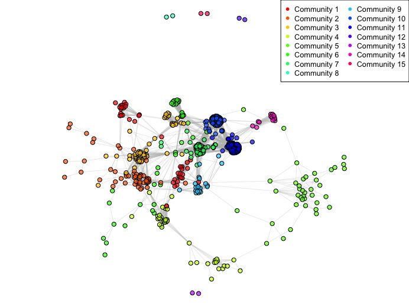
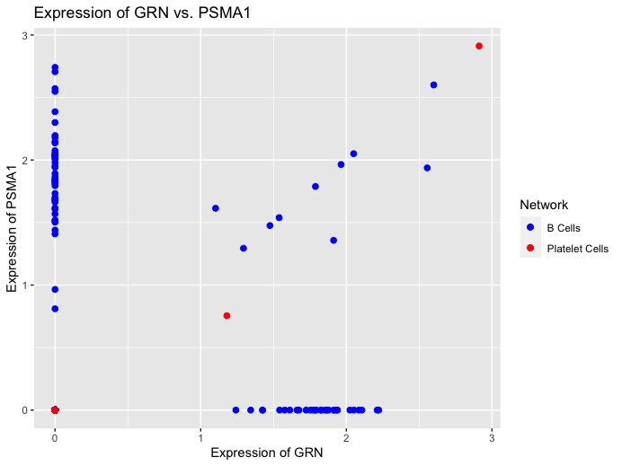

```{r, include = FALSE}
knitr::opts_chunk$set(
  collapse = TRUE,
  message = FALSE,
  warning = FALSE,
  comment = "#>"
)
```
```
```{r setup}
# Load packages needed for the tutorial
devtools::install_github("vishali-u/DiffCoExpr")
library(DiffCoExpr)
library(Seurat)
```

## Introduction

`DiffCoExpr` is an R package developed to construct coexpression networks from single cell RNA-seq data, and identify pairs of genes that are differentially coexpressed between pairs of coexpression networks. This can include constructing cell-type-specific coexpression networks and determining if genes that are coexpressed in both cell types are coexpressed at the same level or if the pairs are differentially coexpressed. The input to DiffCoExpr is gene-barcode matrices that are generated during alignment using the cellranger pipeline. By working with output directly from the cellranger pipeline, `DiffCoExpr` will save users from having to perform many intermediate steps between alignment and coexpression construction. 

To download **DiffCoExpr**, use the following commands:

``` r
require("devtools")
devtools::install_github("vishali-u/DiffCoExpr", build_vignettes = TRUE)
library("DiffCoExpr")
```
To list all sample functions available in the package:
``` r
ls("package:DiffCoExpr")
```

To list all sample datasets available in the package:
``` r
data(package = "DiffCoExpr")
```

<br>

## Tutorial on 3k PBMCs from a Healthy Donor Datasest downloaded from 10X Genomics

This document will go over the steps needed to construct and compare coexpression networks generated from peripheral blood mononuclear cells (PBMCs) from a healthy donor. There are 2,700 cells in total in this dataset. 

### Step 1: Prepare the data
To construct a Seurat object containing normalized counts and annotated clusters using the sample data:

``` r
geneBCMatrixPath <- system.file("extdata", 
                                "filtered_gene_bc_matrices", 
                                package = "DiffCoExpr")
cellTypesPath <- system.file("extdata", 
                             "cellTypes.csv",
                             package = "DiffCoExpr")
srat <- prepareData(geneMatrixPath = geneBCMatrixPath, 
                   cellTypesPath = cellTypesPath)
```

To examine the cell identities in the Seurat object:

``` r
Idents(srat)
```

### Step 2: Construct the expression and correlation matrices
We can limit our data to just one cell type. Here we are only interested in constructing the matrices for platelet cells and the matrices for B cells.

``` r
exprMatrixB <- getExpressionMatrix(srat = srat, cellType = "B")
corrMatrixB <- getCorrelationMatrix(expressionMatrix = exprMatrixB)

exprMatrixPlatelet <- getExpressionMatrix(srat = srat, cellType = "platelet")
corrMatrixPlatelet <- getCorrelationMatrix(expressionMatrix = exprMatrixPlatelet)
```

### Step 3: Construct a coexpression network 
Next, we will use the correlation matrix to construct a coexpression network, or more specifically a table of all coexpressed genes and the correlation between the genes. We leave the minimum correlation threshold as its default value (0.8). 

``` r
coexprNetworkB <- getCoexpressionNetwork(correlationMatrix = corrMatrixB)
coexprNetworkPlatelet <- getCoexpressionNetwork(correlationMatrix = corrMatrixPlatelet)
```

### Step 4: Create a coexpression network graph
Next, we can detect communities in the coexpression network and plot the network. Communities refer to groups of genes that are highly coexpressed with other members of the group, but only a few genes are coexpressed with a few genes in other communities.

```r
networkPlot <- plotCoexpressionNetwork(edgeList = coexprNetworkPlatelet)
networkPlot
```

<div style="text-align:center"></div>

In platelet cells, we see that 15 communities were detected in this run.

### Step 5: Get a table of differentially coexpressed genes
Next, we can compare two coexpression networks that were generated under two different conditions or were sampled from two different cell types. We get a table of genes that are differentially coexpressed. Each row contains a pair of genes, the correlation of the pair in the first cell type, and the correlation of the pair in the second cell type. We also get the log2 fold change in correlation. Only pairs of genes with a log2 fold change greater than 0.5 are selected by default.

```r
diffCoexpressed <- getDifferentialCoexpression(networkA = coexprNetworkB, 
                                               networkB = coexprNetworkPlatelet)
head(diffCoexpressed, 10)
```

### Step 6: Plot expression levels of two coexpressed genes across cells under different conditions
Finally, we can visualize how coexpression changes under different conditions or cell types. We can get a plot that visualizes the correlation in expression level of two coexpressed genes from two different conditions or cell types. 

```r
diffCoexprPlot <- plotDifferentialCoexpression(diffCoexpTable = diffCoexpressed,
                                               expressionMatrixA = exprMatrixB,
                                               expressionMatrixB = exprMatrixPlatelet,
                                               gene1 = 'GRN', 
                                               gene2 = 'VDAC3',
                                               conditionA = 'B Cells',
                                               conditionB = 'Platelet Cells')
diffCoexprPlot
```

<div style="text-align:center"></div>
Here we see the correlation of expression levels of GRN and VDAC3 between B cells and platelet cells. Although there are far more B cells that platelet cells, it seems likely that coexpression of GRN and VDAC3 is at a similar strength in B cells and platelet cells since we see more points along the diagonal, and no change in scatter between the two cell types.

## Package References

- Umaiyalan, V. (2023) DiffCoExpr: Construct and compare coexpression networks
  from scRNA-seq. Unpublished. https://github.com/vishali-u/DiffCoExpr

<br>

## Other References

- Butler A, Hoffman P, Smibert P, Papalexi E, Satija R (2018) Integrating single-cell transcriptomic data across different conditions, technologies, and species. *Nature Biotechnology* 36, 411-420. https://doi.org/10.1038/nbt.4096

- Butler, A. (2015). Seurat: Tools for Single Cell Genomics R package. https://cran.r-project.org/web/packages/Seurat

- Chowdhury H., Bhattacharyya D., Kalita J (2020) (Differential) coexpression Analysis of Gene Expression: A survey of Best Practices. *IEEE/ACM Transactions on Computational Biology and Bioinformatics* 17. https://ieeexplore.ieee.org/document/8613814

- Contreras-Lopez, Moyano T., Soto D., Gutierrez R (2018) Step-by-Step Construction of Gene coexpression Networks from High-Throughput Arabidopsis RNA Sequencing Data. *Methods in Molecular Biology* https://pubmed.ncbi.nlm.nih.gov/29525965/

- Eisen M., Spellman P., Brown P., Botstein D (1998) Cluster analysis and display of genome-wide expression patterns. *Biological Sciences* 95. https://www.pnas.org/doi/10.1073/pnas.95.25.14863

- Hennetin J., Pehkonen P., Bellis M (2009) Construction and use of gene expression covariation matrix. *BMC Bioinformatics* 10. https://bmcbioinformatics.biomedcentral.com/articles/10.1186/1471-2105-10-214

- Lemoine G., Scott-Boyer M., Ambroise B., Perin O., Droit A (2021) GWENA: gene coexpression networks analysis and extended modules characterization in a single Bioconductor package. *BMC Bioinformatics* 22. https://bmcbioinformatics.biomedcentral.com/articles/10.1186/s12859-021-04179-4

- R Core Team (2023). R: A language and environment for statistical computing. R Foundation for Statistical Computing, Vienna, Austria. https://www.R-project.org/

- Su C., Xu Z., Shan X., Cai B., Zhao H., Zhang J (2023) Cell-type-specific coexpression inference from single cell RNA-sequencing data. *Nature Communications* 14. https://www.nature.com/articles/s41467-023-40503-7

- Wickham, H. and Bryan, J. (2019). *R Packages* (2nd edition). Newton, Massachusetts: O'Reilly Media. https://r-pkgs.org/

----

```{r}
sessionInfo()
```